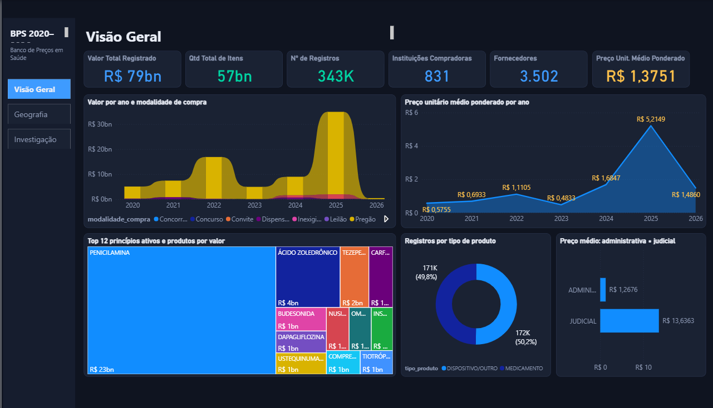
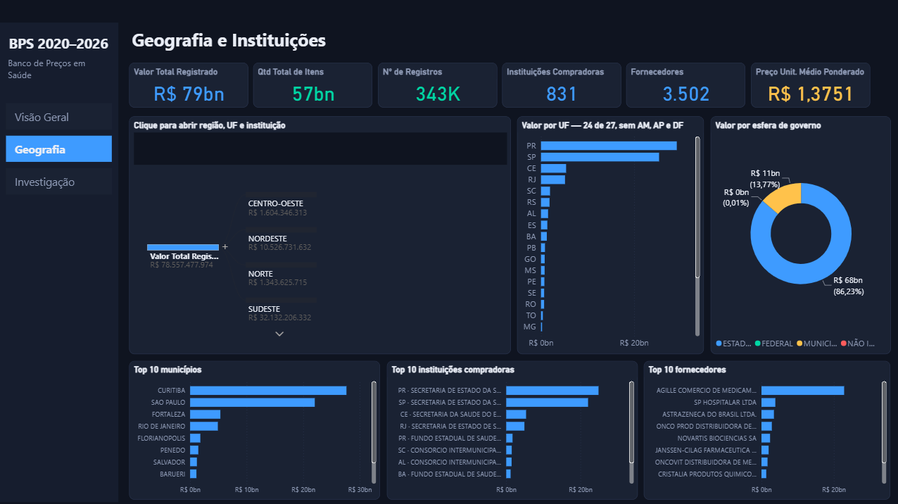
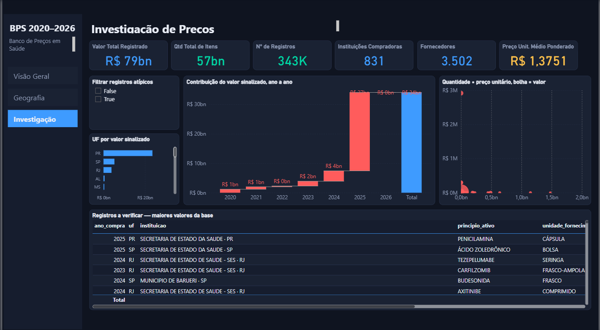

# Banco de Preços em Saúde — Dashboard analítico 2020–2026

Mini-Projeto Avaliativo do Módulo 2 — Semana 06
Curso de Visualização de Dados e Business Intelligence — T2 (SCTEC)
Aluno: **Leo Gobel**

---

Video
https://drive.google.com/file/d/10CYkMhWxp_wb1XrzRyEB7xezzofyrAxF/view?usp=drive_link


---

## 1. Objetivo do projeto

Transformar os dados públicos do **Banco de Preços em Saúde (BPS)** do
Ministério da Saúde, referentes a 2020–2026, em um dashboard analítico que
permita acompanhar as compras de medicamentos e dispositivos médicos por ente
federado, produto, fornecedor e período — e, principalmente, **identificar
registros cujo preço unitário destoa dos comparáveis**, apontando onde vale a
pena investigar.

## 2. Contextualização do problema

A aquisição pública de medicamentos e materiais hospitalares envolve grande
volume financeiro, milhares de fornecedores, várias modalidades de compra e
uma enorme variedade de produtos. Sem uma visão consolidada, é difícil para um
gestor responder a perguntas simples: quanto foi registrado, por quem, a que
preço, e esse preço está em linha com o que outras instituições pagaram pelo
mesmo item.

O BPS existe justamente para subsidiar compras mais eficientes. Mas a base é
publicada em arquivos anuais separados, com centenas de milhares de linhas, e
nesse formato ela não responde nada — é insumo, não informação.

Este projeto faz a ponte: consolida os sete anos, trata as inconsistências,
define os indicadores e entrega um dashboard onde as perguntas de negócio têm
resposta em um clique.

## 3. Fonte dos dados

- **Dataset:** Banco de Preços em Saúde — Portal Brasileiro de Dados Abertos
  https://dadosabertos.saude.gov.br/dataset/bps
- **Dicionário de dados oficial:**
  https://dadosabertos.saude.gov.br/dataset/bps/resource/0e76f527-5e7e-417d-9d0b-f46d00afb717

Foram utilizados os arquivos `.csv` dos anos de **2020 a 2026**, preservados
neste repositório em `data/raw/` exatamente como baixados.

## 4. Perguntas de negócio

Definidas antes da construção do dashboard, para dirigir o que ele precisa
responder.

| # | Pergunta | Onde é respondida |
|---|---|---|
| 1 | Como evoluiu o valor total registrado entre 2020 e 2026, e como se comporta o número de registros no período? | P1 — evolução anual |
| 2 | Quais UFs, municípios e instituições concentram o maior volume financeiro, e esse ranking se sustenta sem os registros atípicos? | P2 + P3 |
| 3 | Quais princípios ativos e dispositivos respondem pela maior parte do valor e da quantidade? | P1 — top 10 princípio ativo |
| 4 | Quais fornecedores e fabricantes têm maior participação, e qual o grau de concentração? | P2 — fornecedores × fabricantes |
| 5 | Qual a modalidade de compra predominante, e o preço médio ponderado varia entre modalidades? | P1 — modalidade |
| 6 | Para o mesmo produto e mesma unidade de fornecimento, qual a dispersão do preço unitário? | P3 — dispersão |
| 7 | Quantos registros têm preço desproporcional à mediana do grupo comparável, e qual seu peso no total? | P3 — KPIs de atípicos |
| 8 | Compras judiciais têm preço unitário diferente das administrativas? | Filtro `tipo_compra` |

## 5. Procedimentos de download e concatenação

Os sete arquivos foram baixados compactados do portal e mantidos em
`data/raw/<ano>_csv.zip`. A concatenação foi feita em **Python (pandas)**, e
não em Excel ou Power Query, porque o script fica versionado e o avaliador
pode reproduzir o resultado exato.

```bash
pip install -r requirements.txt
python -m src.perfil_dados    # relatório de discrepâncias entre os anos
python -m src.consolidar      # gera a base consolidada e tratada
```

`src/io_bps.py` lê cada `.csv` de dentro do próprio `.zip`, sem descompactar em
disco, e acrescenta a coluna `arquivo_origem` para rastrear a proveniência de
cada linha. `src/consolidar.py` empilha os sete anos em ordem cronológica,
aplica os tratamentos e grava a base única.

**Resultado:** `data/processed/BPS_20_26_LeoGobel.zip` (25,3 MB), contendo
`BPS_20_26_LeoGobel.csv` (155,8 MB, 342.697 linhas × 33 colunas). O `.csv` não
é versionado porque ultrapassa o limite de 100 MB por arquivo do GitHub — o
`.zip` é o arquivo entregue, e o `.csv` é reproduzido pelo comando acima.

## 6. Mapeamento de discrepâncias entre os anos

O relatório completo está em [`docs/perfil_discrepancias.md`](docs/perfil_discrepancias.md),
gerado por script e não escrito à mão.

**Não há discrepância de esquema.** Os sete arquivos têm as mesmas **25
colunas**, na mesma ordem, com o mesmo separador (`;`) e a mesma codificação
(UTF-8). Isso foi verificado programaticamente, não presumido.

As divergências reais entre os anos são de volume e de qualidade:

| Discrepância | Observação |
|---|---|
| Queda de volume | 88.991 registros em 2022 → 31.992 em 2023 (**−64%**) |
| Ano parcial | 2026 tem 819 registros; a base vai até 05/03/2026 |
| Nulos em `generico` e `anvisa` | caem de 56,2% (2020) para 20,5% (2026) |
| Nulos em `capacidade` e `unidade_medida` | ~63% de forma estável em todos os anos |
| Duplicatas exatas | só a partir de 2024 — 16 em 2024, 1 em 2025, 2 em 2026 |
| Valor inválido em `esfera` | `"0"` em 43 registros, todos de 2020 |
| Cobertura geográfica | **AM, AP e DF sem nenhum registro** — 24 de 27 UFs |
| Acentuação | 2.578 descrições com acento minúsculo dentro de texto maiúsculo (`APRESENTAçãO`) |

## 7. Tratamentos e transformações realizados

Todos implementados em `src/tratamento.py` como funções puras e cobertos por
testes automatizados.

| Tratamento | O que foi feito | Linhas afetadas |
|---|---|---|
| Duplicatas | Remoção de linhas idênticas em todas as colunas | 19 |
| Tipos numéricos | `qtd_itens_comprados`, `preco_unitario` e `preco_total` convertidos para numérico | 342.697 (nenhum valor inválido encontrado) |
| Datas | `compra` e `insercao` lidas como `%d/%m/%Y` e gravadas em ISO `YYYY-MM-DD` | 342.697 |
| Acentuação | `descricao_catmat` uniformizada em caixa alta, corrigindo o acento minúsculo em meio a maiúsculas | 2.578 |
| Espaçamento | `nome_instituicao` com espaços das pontas removidos e internos colapsados (`"FUNDO  MUNICIPAL  DE  SAUDE"`) | — |
| `esfera` inválida | Valor `"0"` e nulos substituídos por `NÃO INFORMADO` | 43 |
| Nulos em `anvisa`/`generico` | **Não imputados.** A ausência indica item que não é medicamento e virou a coluna `tipo_produto` | 172.034 |

### Colunas derivadas

| Coluna | Definição |
|---|---|
| `arquivo_origem` | CSV anual de onde a linha veio |
| `tipo_produto` | `MEDICAMENTO` se há registro Anvisa, senão `DISPOSITIVO/OUTRO` |
| `principio_ativo` | Primeiro token de `descricao_catmat` — 2.198 valores contra 12.994 códigos CATMAT |
| `regiao` | Região geográfica derivada da UF |
| `n_grupo` | Tamanho do grupo comparável (`codigo_br` + `unidade_fornecimento`) |
| `mediana_grupo` | Mediana do preço unitário no grupo |
| `razao_vs_mediana` | `preco_unitario / mediana_grupo` |
| `flag_preco_atipico` | `Verdadeiro` quando `n_grupo >= 5` e `razao_vs_mediana >= 10` |

### Validações do pipeline

O script falha e interrompe a gravação se qualquer uma não passar:

- 342.716 linhas lidas → 19 duplicatas → 342.697 gravadas
- `qtd_itens_comprados × preco_unitario = preco_total` em **100%** das linhas
- Todos os sete anos presentes na base final

## 8. Descrição das principais colunas

| Coluna | Descrição |
|---|---|
| `ano_compra` | Ano da compra |
| `compra` / `insercao` | Data da compra e data de inserção no BPS |
| `nome_instituicao` / `cnpj_instituicao` | Instituição compradora |
| `esfera` | Municipal, Estadual, Federal ou Não Informado |
| `municipio_instituicao` / `uf` | Localidade da instituição |
| `codigo_br` | Código CATMAT do item |
| `descricao_catmat` | Descrição completa do item |
| `unidade_fornecimento` | Forma de fornecimento (AMPOLA, FRASCO, COMPRIMIDO…) |
| `generico` / `anvisa` | Indicador de genérico e registro na Anvisa |
| `modalidade_compra` | Pregão, Dispensa, Registro de Preços, etc. |
| `tipo_compra` | Administrativa ou Judicial |
| `fornecedor` / `cnpj_fornecedor` | Quem vendeu |
| `fabricante` / `cnpj_fabricante` | Quem fabricou |
| `qtd_itens_comprados` | Quantidade adquirida |
| `preco_unitario` | Preço por unidade de fornecimento |
| `preco_total` | `qtd_itens_comprados × preco_unitario` |

## 9. KPIs e métricas

Definições completas em [`dashboard/medidas_dax.md`](dashboard/medidas_dax.md).

| KPI | Fórmula | Valor sem filtros |
|---|---|---|
| Valor Total Registrado | `SUM(preco_total)` | R$ 78.557.477.974,09 |
| Qtd Total de Itens | `SUM(qtd_itens_comprados)` | 57.127.143.721 |
| Nº de Registros | `COUNTROWS(fBPS)` | 342.697 |
| Instituições Compradoras | `DISTINCTCOUNT(cnpj_instituicao)` | 831 |
| Fornecedores | `DISTINCTCOUNT(cnpj_fornecedor)` | 3.502 |
| Preço Unit. Médio Ponderado | `DIVIDE([Valor Total], [Qtd Total])` | R$ 1,3751 |

**Duas decisões que merecem explicação:**

A contagem distinta usa **CNPJ, não nome**. A base tem 831 CNPJs de instituição
para apenas 663 nomes distintos — a mesma instituição aparece grafada de várias
formas, e contar por nome subestimaria o indicador em 20%.

O preço médio ponderado é **razão de somas**, nunca `AVERAGE(preco_unitario)`.
Uma média simples daria o mesmo peso a uma compra de 10 unidades e a uma de 4
milhões. Dividir o valor total pela quantidade total dá o preço efetivamente
pago por unidade.

## 10. Dashboard

<!-- As capturas são geradas na etapa de construção do dashboard -->

### Página 1 — Visão Geral


### Página 2 — Geografia e Instituições


### Página 3 — Investigação de Preços


O projeto editável está em `dashboard/BPS_2020_2026.pbip`, no formato **PBIP**
(Power BI Project): o modelo em TMSL (`model.bim`) e o relatório em PBIR, ambos
JSON legíveis e versionáveis — é por isso que o `git diff` deste repositório
mostra mudanças de dashboard linha a linha, e não um binário opaco.

São **55 visuais** em três páginas de 1660×900, sobre tema escuro próprio
(`StaticResources/RegisteredResources/BPS_Escuro.json`). As três páginas
compartilham o mesmo trilho de navegação à esquerda, com botões nativos, de
modo que o relatório se opera como um painel único com abas.

Além de cartões e barras, o dashboard usa tipos de visual escolhidos pela
interação que oferecem:

| Visual | Página | Para quê |
|---|---|---|
| Árvore de decomposição | Geografia | Abre região → UF → instituição no clique, sem sair da página |
| Gráfico de fita (ribbon) | Visão Geral | Mostra a troca de posição entre modalidades ao longo dos anos |
| Cascata | Investigação | Decompõe os R$ 34 bi sinalizados, ano a ano, até o total |
| Dispersão com bolha | Investigação | Quantidade × preço unitário, tamanho = valor |
| Treemap | Visão Geral | Top 12 produtos por valor, com a Penicilamina dominando a área |
| Rosca | Visão Geral / Geografia | Composição por tipo de produto e por esfera |
| Área | Visão Geral | Série do preço unitário médio ponderado |

Segmentações sincronizadas de Ano, UF, Esfera, Modalidade, Tipo de produto e
Flag de preço atípico.

## 11. Principais análises e descobertas

**Um único registro responde por 29% de toda a base.** Penicilamina 250 mg,
Secretaria de Estado da Saúde do Paraná, 2025: 77.500 unidades a **R$ 294.400,00
cada**, totalizando R$ 22,8 bilhões. Os dez maiores registros somam 42,7% do
valor total.

**O ranking de UF se inverte quando os atípicos saem.** Com eles, o Paraná
lidera com R$ 29,2 bi. Sem eles, São Paulo lidera com R$ 20,1 bi e o Paraná cai
para R$ 5,6 bi — sexta posição em valor. O Paraná só aparece como maior
comprador do país por causa daquele registro.

**Os atípicos são 1,44% das linhas e 43,3% do dinheiro.** São 4.922 registros
carregando R$ 34,0 bi. Excluí-los derruba o preço unitário médio ponderado de
R$ 1,3751 para R$ 0,7795 — praticamente metade.

**O critério é robusto.** Elevar o corte de 10× para 20× ou 50× a mediana do
grupo captura praticamente o mesmo valor (R$ 34,0 bi e R$ 33,8 bi), o que
mostra que a conclusão não depende do limiar escolhido.

**Nem toda dispersão é erro.** O cloreto de sódio 0,9% varia 1.403× entre o
menor e o maior preço unitário, mas isso se explica: a base mistura AMPOLA,
BOLSA e FRASCO no mesmo código. Já a enoxaparina 100 mg/ml varia **4.372×
dentro da mesma unidade SERINGA** — essa não tem explicação de apresentação.
Foi por isso que o grupo de comparação usa `codigo_br` **e**
`unidade_fornecimento`, e não só o código.

**O volume de registros despencou após 2022**, de 88.991 para 31.992 (−64%),
enquanto o valor registrado continuou subindo. Menos registros, cada um maior.

## 12. Recomendações

1. **Verificar os 4.922 registros sinalizados antes de usar o BPS como
   referência de preço.** Eles não invalidam a base, mas distorcem qualquer
   média que os inclua.
2. **Usar preço mediano por grupo comparável**, e não média, ao pesquisar
   preço de referência para uma licitação. A mediana é imune aos outliers que
   dominam esta base.
3. **Comparar somente dentro da mesma unidade de fornecimento.** Preço por
   AMPOLA e por BOLSA do mesmo princípio ativo não são a mesma grandeza.
4. **Considerar a ausência de AM, AP e DF** ao usar a base para comparações
   regionais ou nacionais — a cobertura não é completa.
5. **Investigar a queda de registros pós-2022** junto à fonte antes de
   interpretar a série histórica como tendência de mercado.

## 13. Limitações

- **Cobertura geográfica incompleta:** 24 das 27 UFs. AM, AP e DF não aparecem.
- **2026 é ano parcial**, com dados até 05/03/2026 — não comparável aos demais.
- **`capacidade` e `unidade_medida` são nulos em ~63%** dos registros, o que
  impede normalizar preço por miligrama ou mililitro de forma abrangente.
- **O flag de preço atípico é indício, não prova.** Diferenças de preço podem
  decorrer de fabricante, apresentação, unidade de fornecimento, quantidade
  adquirida, localidade, modalidade de compra, período e características
  específicas da negociação. Nada aqui afirma sobrepreço ou irregularidade.
- **Grupos com menos de 5 registros não são avaliados** pelo flag, por não
  estabelecerem uma referência de preço confiável. São 4,1% da base.
- **A base registra preços declarados**, não necessariamente pagos.

## 14. Instruções para reprodução

```bash
git clone https://github.com/gobels2/Mini-Projeto-Avaliativo-Modulo-2-Semana-06-SCTEC.git
cd Mini-Projeto-Avaliativo-Modulo-2-Semana-06-SCTEC

pip install -r requirements.txt

python -m src.perfil_dados    # gera docs/perfil_discrepancias.md
python -m src.consolidar      # gera data/processed/BPS_20_26_LeoGobel.csv e .zip

python -m pytest -q           # 32 testes
```

Para regenerar o projeto do Power BI a partir dos scripts (opcional — ele já
está versionado pronto):

```bash
python src/gerar_pbip.py dashboard "<caminho absoluto do BPS_20_26_LeoGobel.csv>"
python src/gerar_dashboard.py     # aplica layout, tema escuro e os 55 visuais
python src/validar_pbip.py dashboard .cache-schemas   # confere contra os schemas oficiais da Microsoft
```

### Abrir o dashboard

1. No Power BI Desktop, habilitar **Arquivo > Opções e configurações > Opções >
   Recursos de visualização > "Armazenar relatórios usando o formato de
   metadados avançado (PBIR)"** e reiniciar. Sem isso o Desktop ignora a pasta
   `definition/` e abre o relatório em branco.
2. Abrir `dashboard/BPS_2020_2026.pbip`.
3. Na primeira abertura o Desktop pede para atualizar o modelo — é esperado,
   porque o projeto é versionado sem cache de dados. Confirmar.

O caminho do CSV está gravado na consulta Power Query. Se a fonte estiver
quebrada depois de clonar em outra pasta, apontar para
`data/processed/BPS_20_26_LeoGobel.csv` com codificação **UTF-8**, delimitador
**ponto e vírgula** e cultura **en-US** (o arquivo usa ponto decimal e datas
ISO; ler como pt-BR multiplicaria os valores por dez).

### Estrutura do repositório

```
├── data/
│   ├── raw/                 os sete .csv anuais originais, compactados
│   └── processed/           BPS_20_26_LeoGobel.zip — base consolidada
├── src/
│   ├── io_bps.py            leitura dos arquivos anuais
│   ├── perfil_dados.py      perfil e mapeamento de discrepâncias
│   ├── tratamento.py        limpeza, colunas derivadas e flag
│   ├── consolidar.py        orquestração e validações
│   ├── gerar_pbip.py        gera o projeto Power BI (modelo + relatório)
│   ├── gerar_dashboard.py   layout, tema escuro e os 55 visuais
│   └── validar_pbip.py      valida o projeto contra os schemas oficiais
├── tests/                   32 testes automatizados
├── dashboard/
│   ├── BPS_2020_2026.pbip           projeto Power BI
│   ├── BPS_2020_2026.SemanticModel/ modelo em TMSL (model.bim)
│   ├── BPS_2020_2026.Report/        relatório em PBIR + tema escuro
│   ├── medidas_dax.md               definição de todas as medidas
│   └── img/                         capturas das três páginas
└── docs/
    ├── perfil_discrepancias.md      relatório gerado por script
    └── planejamento/
        ├── documento-de-projeto/     escopo, decisões e critérios de aceite
        └── plano-de-implementacao/   as tarefas, na ordem em que foram feitas
```

As duas pastas em `docs/planejamento/` foram escritas **antes** do código: a
primeira define o que o projeto precisa entregar e por quê, a segunda quebra
isso nas tarefas que viraram as branches deste repositório.
